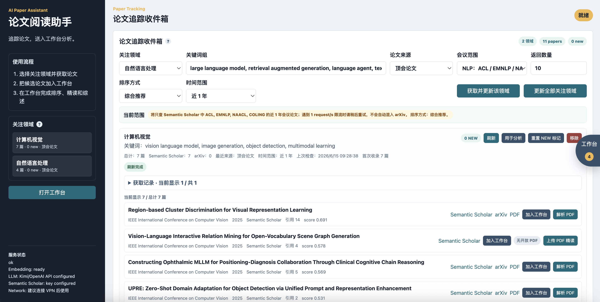
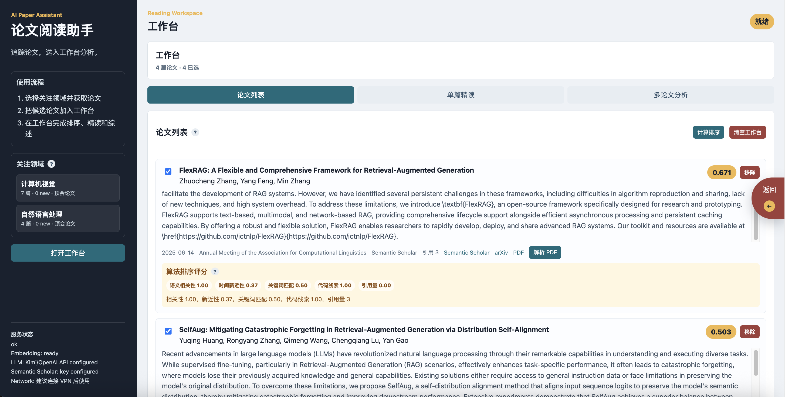
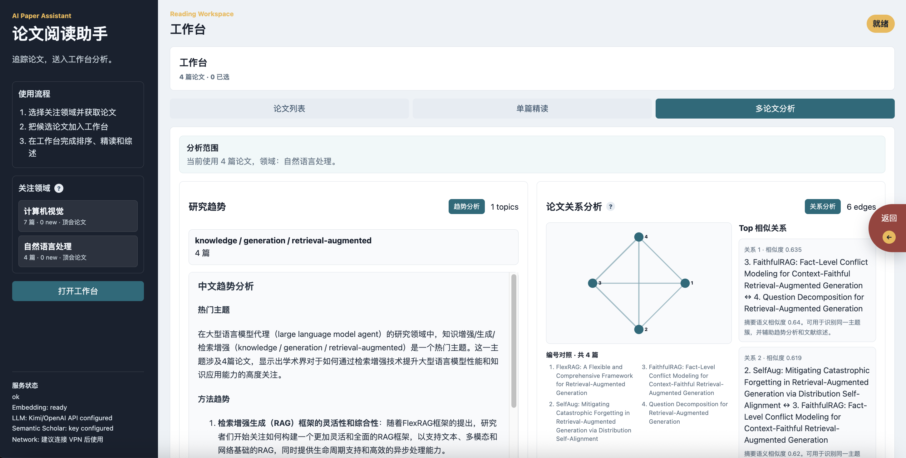
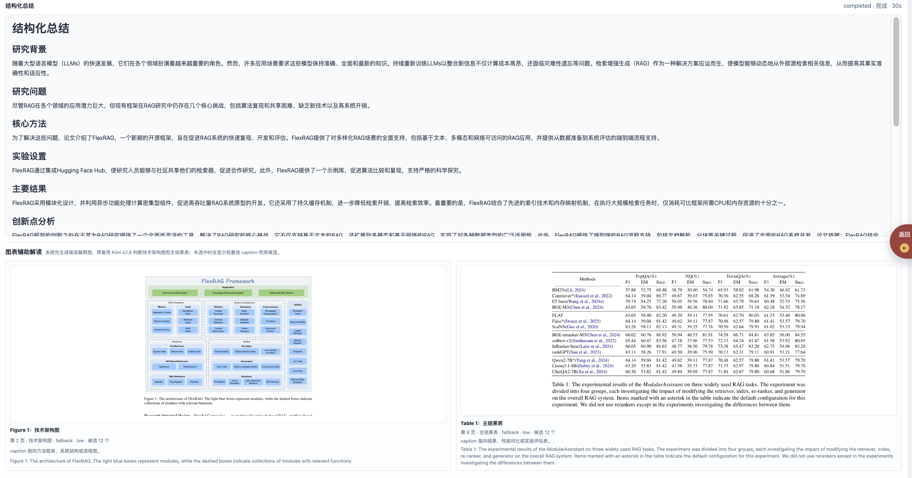

# Paper Reading Assistant｜论文阅读助手

**论文阅读助手** 是一个面向科研阅读场景的 AI 学术助手，目标是减少研究者在论文发现、筛选、精读、问答和知识沉淀中的重复劳动。系统支持关注领域追踪、论文元信息自动获取、可解释排序、PDF 解析、结构化总结、Reviewer 视角分析、论文问答、多论文趋势分析、关系分析与文献综述生成。

## Screenshots

### Paper Tracking Inbox

关注领域追踪入口支持选择研究领域、关键词组、论文来源、会议范围、时间范围和排序方式；系统会自动获取论文元信息，并按领域合并去重。



### Reading Workbench

工作台用于承接候选论文，支持可解释排序、论文筛选、单篇精读和多论文分析。排序分数来自语义相关性、新近性、关键词匹配、代码线索和引用量等算法指标。



### Multi-paper Analysis

多论文分析支持研究趋势分析和论文关系分析，帮助用户发现一组论文之间的主题聚类、方法相似性和综述脉络。



### PDF Reading and Visual Summary

单篇精读支持 PDF 解析、结构化总结、Reviewer 分析、问答历史和图表辅助总结；系统会尝试识别技术架构图与主结果表，辅助理解论文核心贡献。



## Features

- 关注领域追踪：按用户选择的研究领域和关键词，从 Semantic Scholar 与 arXiv 获取最新论文信息。
- 自动获取论文元信息：包含标题、作者、摘要、会议/来源、年份、引用量、论文链接与开放 PDF 链接。
- 可解释排序：结合语义相关性、时间新近性、关键词匹配、代码线索和引用量生成综合排序。
- PDF 精读：支持在线解析开放 PDF，也支持手动上传本地 PDF。
- 结构化总结：基于论文全文生成背景、问题、方法、实验、结果、创新点、局限与未来方向。
- Reviewer 分析：从审稿人视角生成优点、不足、追问、缺失实验和改进建议。
- 论文问答：基于已解析 PDF 文本检索相关片段，并调用 OpenAI-compatible LLM 生成回答。
- 图表辅助总结：解析 PDF 后尝试识别技术架构图与主结果表，并在结构化总结中辅助解读。
- 多论文分析：支持趋势分析、论文关系分析和自动文献综述。
- Agent 轨迹：展示检索、排序、PDF 解析、LLM 生成等关键步骤的执行过程。

## Tech Stack

- Frontend: Vite, React, CSS
- Backend: FastAPI, pypdf, PyMuPDF, sentence-transformers
- Data Sources: Semantic Scholar API, arXiv API
- LLM: OpenAI-compatible API, such as Moonshot/Kimi
- Deployment: Docker Compose

## Quick Start

1. Copy the environment template:

```bash
cp .env.example .env
```

2. Fill in the LLM and optional Semantic Scholar configuration:

```bash
LLM_API_KEY=your_api_key
LLM_BASE_URL=https://api.moonshot.cn/v1
LLM_MODEL=moonshot-v1-8k
SEMANTIC_SCHOLAR_API_KEY=optional
```

3. Start the app:

```bash
docker compose up --build
```

4. Open the frontend:

```text
http://localhost:3000
```

Backend health check:

```text
http://localhost:8000/api/health
```

## Local Development

Backend:

```bash
cd backend
python3 -m venv .venv
source .venv/bin/activate
pip install -r requirements.txt
uvicorn app.main:app --reload --host 0.0.0.0 --port 8000
```

Frontend:

```bash
cd frontend
npm install
npm run dev
```

The frontend development server runs at `http://localhost:5173`.

## Workflow

1. Select or create a research field.
2. Choose the paper source: conference papers, arXiv preprints, or hybrid mode.
3. Fetch and update papers for the selected field.
4. Add papers to the workbench.
5. Use single-paper reading for PDF parsing, summary, Reviewer analysis and Q&A.
6. Use multi-paper analysis for ranking, trend analysis, relation analysis and literature review.

## Notes

- Do not commit `.env`; it may contain private API keys.
- Semantic Scholar works best with an API key. Without a key, the system can still use arXiv for paper tracking.
- The project stores user-selected fields, seen paper IDs, workbench papers and local analysis history in browser `localStorage`.
- LLM features require an OpenAI-compatible API key.
- PDF parsing depends on extractable text. Scanned PDFs require OCR before upload.
- Paper relation analysis is based on title/abstract embedding similarity, not a citation network.
- Figure/table extraction is heuristic. The app only shows identified architecture figures and result tables; it avoids using full-page screenshots as if they were precise chart crops.

## Repository Hygiene

This repository intentionally ignores local environment files, build outputs, interaction traces and generated caches. Before publishing, make sure `.env`, `codex_sessions/`, local PDFs and generated images are not included in commits.
